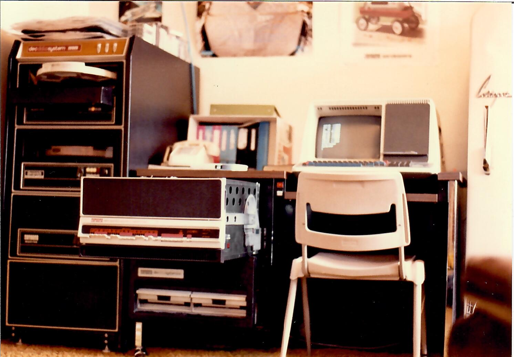

# Digital Equipment Corporation PDP-11 Simulator
This is an instruction set simulator.  No effort has been made for timing or
cycle accuracy.  Software that does not depend on instruction timing will
probably work.

Most basic instructions have been implemented and have had basic sanity checks.
It is expected that there some bugs still remain.  In particular, I'm not
entirely sure that I have the flags correct.  Since I wrote both the
implementation and test, any misunderstanding would show up in both.  I
would appreciate other eyes to take a look at this (and everything else),
and write issues, if necessary.

There are several models of the PDP-11 with some subtle differences in
how some instructions work, particularly operating a register with the
same register in an indirect auto-increment/decrement mode.

The initial goal is to implement a PDP-11/10 and get RT-11 to boot on it.
This will also require simulating some hardware elements, particularly
a KL11 and a DL11, which are part of the KD11-B (PDP-11/10 and PDP-11/05)
processor.  In addition some storage devices will also have to be simulated -
probably a PC11 for some initial testing of paper tape software and then
a RK11 controller for some RK05 disk drives.  After that, we'll see.

At one point I owned the PDP-11/10 below.  It had 2 RK05 drives and 1
RK05F.  It also had 16Kwords of magnetic code memory.  The terminal in
the picture is a VT50 and actually came with a different computer (I
believe it was a DEC Datasystem-310 which had a PDP-8/A processor, the
floppy disks, the desk, and terminal).

