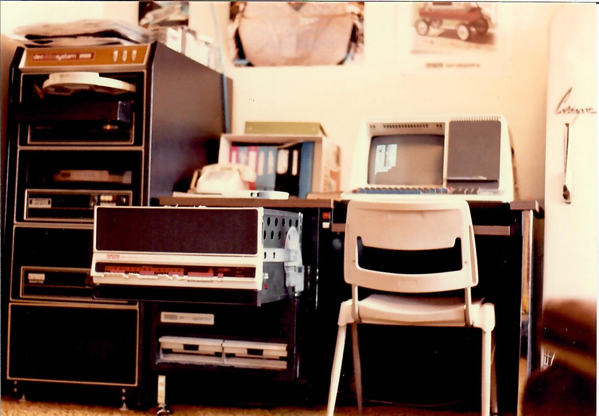

# Digital Equipment Corporation PDP-11 Simulator
This is an instruction set simulator.  No effort has been made for timing or
cycle accuracy.  Software that does not depend on instruction timing will
probably work.

The basic PDP-11 instructions have been implemented and the following
DEC diagnostics have passed:
* ZKAAA0.BIN - Test 1 branch
* ZKABA0.BIN - Test 2 conditional branch
* ZKACA0.BIN - Test 3 unary instructions
* ZKADA0.BIN - Test 4 unary & binary
* ZKAEA0.BIN - Test 5 rotate and shift
* ZKAFA0.BIN - Test 6 compare (equality)
* ZKAGA0.BIN - Test 7 compare (not equal)
* ZKAHA0.BIN - Test 8 move
* ZKAIA0.BIN - Test 9 BIS, BIC, BIT
* ZKAJA0.BIN - Test 10 ADD
* ZKAKA0.BIN - Test 11 SUB
* ZKALA0.BIN - Test 12 JMP
* ZKAMA0.BIN - Test 13 JSR,RTS,RTI
Additional instructions tested:
* CKBAB0.BIC - STX
* CKBBB0.BIC - SOB
* CKBCC0.BIC - XOR
* CKBDC0.BIC - MARK
* CKBEC0.BIC - RTT

There are several models of the PDP-11 with some subtle differences in
how some instructions work, particularly operating a register with the
same register in an indirect auto-increment/decrement mode.  Specific
differences for PDP-11/20 and PDP-11/10 have been implemented.

The initial goal of implementing a PDP-11/10 and getting RT-11 to boot on
it has been achieved.  The simulator is working well enough to boot into
RT-11SJ  V04.00C from a RK05 disk image
(available here)[https://simh.trailing-edge.com/software.html]).  In addition,
RT-11FB  V05.04 F also from the same source is also working.

The following CPU models are currently recognized by RT-11 (SHOW CONFIG
command):
* PDP-11/04
* PDP-11/05, 10
* PDP-11/15, 20

The following devices have been implemented enough to work with RT-11
(more work may be needed for other operating systems):
* DL11 - Serial line interface.
* KW11 - Line time clock.
* RK11 - Disk controller for RK05 drives.
* RK611 - Disk controller for RK06/RK07 (only RK07 implemented) drives.
* PC11 - Paper tape reader/punch controller.

At one point I owned the PDP-11/10 below.  It had 2 RK05 drives and 1
RK05F.  It also had 16Kwords of magnetic code memory.  The terminal in
the picture is a VT50 and actually came with a different computer (I
believe it was a DEC Datasystem-310 which had a PDP-8/A processor, the
floppy disks, the desk, and terminal).

